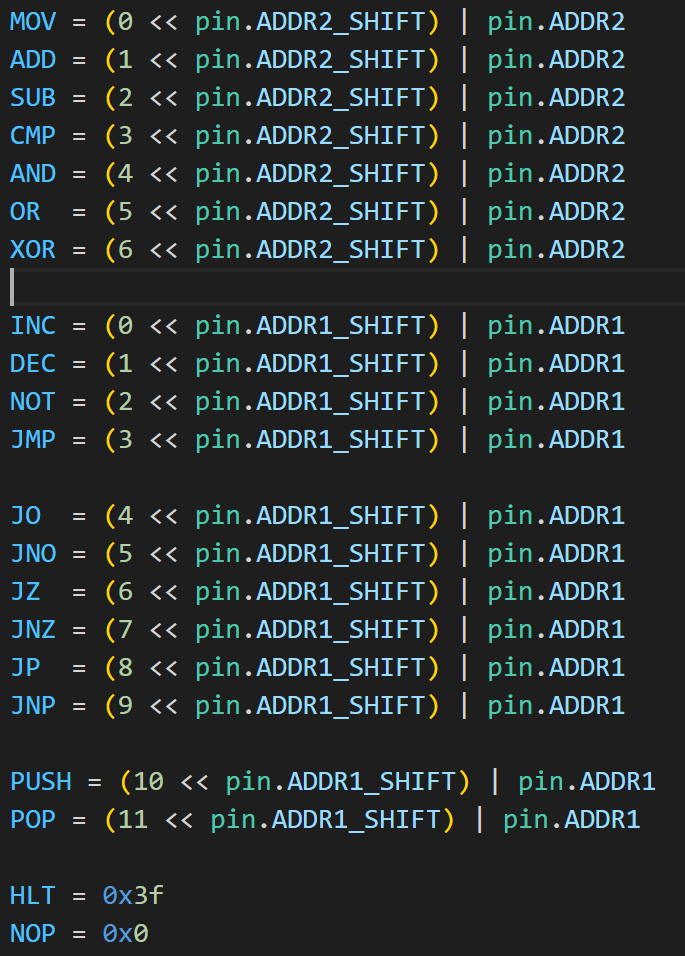
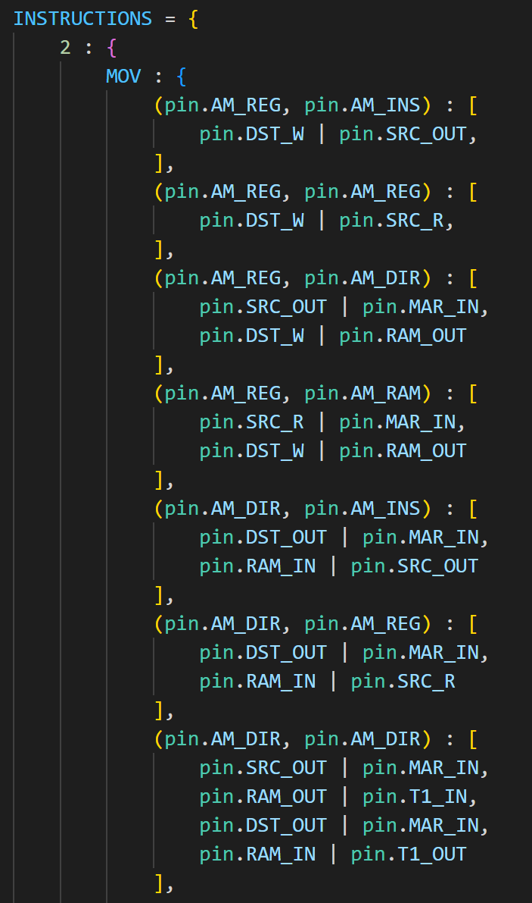

# 指令系统

## 系统设计

### 机器码设计

固定长度机器指令，每个指令不管是一元、二元还是没有操作数都需要占据三个内存单元，即一条指令三个字节；

这三个字节分布对应：

- 第一个字节：指令的机器码；
  - 指令类型
  - 操作数类型
- 第二个字节：目的操作数；
- 第三个字节：源操作数；

特别对，对第一个字节，根据不同操作数个数有以下格式定义：

- 双操作数的指令格式：`1xxx[aa][bb]`；
  - 第 7 位为 1 就表示这个指令是两个操作数；
  - 6-4 位可以定义不同的指令机器码，所以一共只能有  $2^3 = 8$ 个双操作数指令；
  - 3-2 位表示目的操作数类型，只支持四种：
    - 00：立即数寻址，`0x1`；
    - 01：寄存器寻址，`A`；
    - 10：直接寻址，`[0x11]`；
    - 11：寄存器直接寻址，`[SS]`；
  - 1-0 位表示源操作数类型，同上；
- 单操作数的指令格式：`01xxxx[aa]`；
  - 7-6 位为 `01` 表示单操作数指令；
  - 5-2 位可以定义不同的指令机器码，所以一共只能有  $2^4 = 16$ 个单操作数指令；
  - 1-0 位标识目的操作数类型，同上；
- 无操作数的指令格式：`00xxxxxx`：
  - 7-6 位为 `00`  表示无操作数指令；
  - 5-0 位可以定义不同的指令机器码；

### 微操作设计

微操作是对硬件的抽象，一个汇编指令转为多个微操作执行；

比如：`MOV A [0x1]` 需要以下几个微操作：

- 将 `0x1` 送入 `MAR` 寄存器（控制内存）；
- 打开 `A` 寄存器的输入端，打开内存的输出端，这样内存 `0x1` 位置的值进入总线，`A` 寄存器通过总线读取；

所以微操作就是操作一个个寄存器的输入输出端等这样最基本的，可以直接在硬件一步完成的操作；

而实现微操作的是控制器模块。

## 系统实现

分析各个 py 文件的作用

### pin.py

其中包含根据硬件设计定义出的各个寄存器引脚编号、描述各类指令的格式等；

### assembly.py

是机器代码与微程序的桥梁。

首先其定义了每个汇编指令的机器码标识，比如：

还包含了每条汇编代码，对不同操作数类型的微操作定义，比如对 `MOV`，有很多不同的操作数形式：

### controller.py

将每个机器码对应的微程序写入到 ROM 中；

ROM 的作用就是根据当前的输入，即当前执行的程序的机器码、CPU 状态寄存器等值寄存器控制器输出，这些输出控制了所有寄存器的应该位于什么状态：读取总线、写入总线或者什么都不做；

而 controlller 要做的就是根据在 assembly 中定义好的每个机器指令对应的一些列微指令写入 ROM；

CPU 运行时，只要给出 ROM 输入、ROM 的输出就会控制所有的寄存器（还有内存）来执行对应的输入、输出操作；

### complier.py

对汇编源文件进行编译，形成一条一条的机器指令；格式同系统设计中所说，每个指令会对应三个字节，写入到 RAM 中；

编译器与微操作系统关系不大，它只是负责对照机器码，将文本指令转为机器指令，而这类指令机器码的定义位于 assembly.py 中。

### 工作原理

不管执行的是什么指令，前六个操作都是：取内存到 ir 寄存器，取内存到 dst 寄存器，取内存到 src 寄存器；

只有执行完这些指令才能得知这个指令的类型、操作类型、源、目的数是什么。这需要花费六个时钟周期
（每次执行一个新指令，ROM 输入端的最后 4 位一定是 0000，代表新的指令开始，执行完一个时钟周期，加 1）
完成这些后，ROM 中的输入端的：

- 8-15 位代表了接下来要执行的指令（就是刚刚从内存搬到 ir 寄存器的内容，）；
- 7-4 位代表当前的程序状态字（因为目前的指令还没执行，所以此时的 psw 是上一个指令执行完毕后留下的）
- 3-0 位代表目前执行到此指令的哪个时钟周期（这一定大于等于6，因为前六个是取指令、dst 与 src）

之后就根据 ROM 输入定位到要执行的微操作（打开某些寄存器输入与输出，或内存），对应位置的 ROM 输出已经被写入了对应的微操作；

而一条指令有多个微操作，每次完成一个，ROM 最后四位 + 1，自动来到这条指令的下一关微操作，但显然，这个过程 ir、dst、src 寄存器不会变化，输入到 ROM 值总是对应着这条指令的不同微操作；

当前指令执行完毕，ROM 最后四位回到 0000，而不管此时前面几位是什么，总是执行那六个取ir、dst、src微操作；

取完后，才确定了当前的 ROM 的输入，也即确定了 ROM 输入，之后继续上面的步骤，ROM 后四位递增，指向当前指令的下一关微操作；

每次完成一个指令，最后 ROM 输入最后四位清 0 是因为：

分配给每个指令最多 16 个时钟周期，最开始 6 个都相同。

而之后的 10 个可以分配给这个指令，但需要在完成指令后，把 10 个微操作的最后全部填充 40 00 00 00（其实第30位是1即可，看硬件电路）

比如一个指令需要 2 个微操作，那么其最后 8 个都应该是 40 00 00 00，这个命令在硬件中让 ROM 的最后 4 位清零
